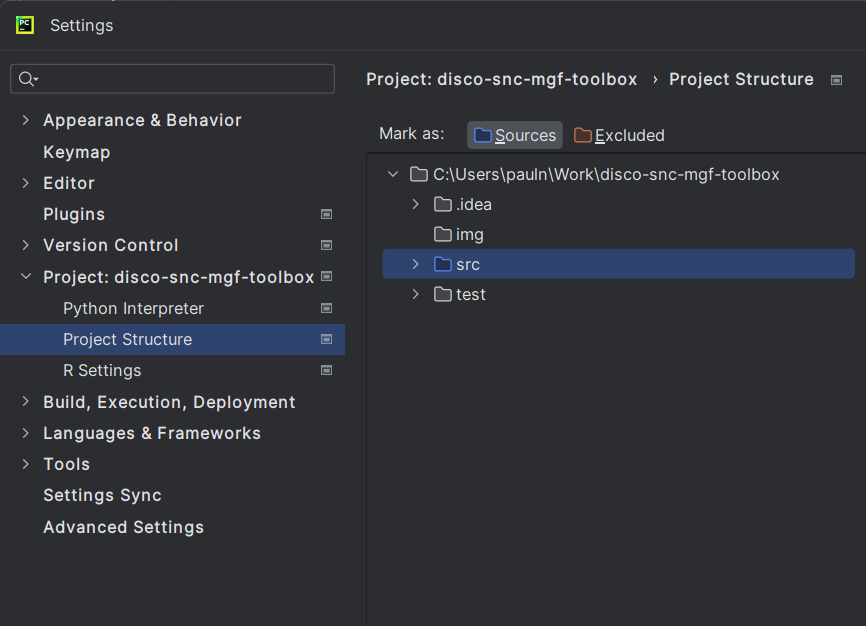

# DISCO SNC MGF Toolbox

A toolbox for the stochastic network calculus (SNC) with moment-generating functions (MGFs) is implemented.
It is focused on $(\sigma, \rho)$-constrained processes.
It provides a list a typical stochastic network calculus arrival processes, operators, and performance bounds in order to conduct end-to-end network analyses.

The toolbox works well with [JetBrains PyCharm](https://www.jetbrains.com/pycharm/) and supports, e.g., features like type hints.
See also the project page at disco: [https://disco.cs.uni-kl.de/projects/snc-toolbox](https://disco.cs.uni-kl.de/projects/snc-toolbox)

## Prerequisites

- Python 3.10 or higher
- Python packages in `requirements.txt`

## Installation

In order to run the code from any file in PyCharm, go to Settings -> Project -> Project Structure and select the src/ folder as a source in the project structure:



## Introduction

#### Compute Bound Directly

The easiest start is to use `Calculate_Examples.py`. Set a performance parameter, e.g., by

```python
OUTPUT_TIME6 = PerformParameter(perform_metric=PerformMetric.OUTPUT, value=6)
```

we compute the output bound for time delta = 6.

```python
SINGLE_SERVER = SingleServerMitPerform(arr=DM1(lamb=1.0),
                                       ser=ConstantRate(rate=10.0),
                                       perform_param=OUTPUT_TIME6)
```

means that we consider the single hop topology with exponentially distributed arrival increments (DM1 with parameter lambda equal to 1) and a constant rate server (with rate 10).

```python
print(SINGLE_SERVER.standard_bound(0.1))
```

for theta = 0.1.

For the output bound computation with the $h$ - mitigator, we insert a list of parameters (first element is theta, the rest are for the new output bound computation):

```python
[0.1, 2.7]
```

and compute

```python
print(SINGLE_SERVER.h_mit_bound([0.1, 2.7]))
```

#### Compute Optimized Bound

Assume we want to optimize the parameter for the above setting. Therefore, we choose to optimize, e.g., via grid search.
We optimize the bound in the SINGLE_SERVER setting with the old approach "Optimize" and the approach OptimizeMitigator. The last step is to choose the method "grid_search()" and to set the search's granularity (in this case = 0.1):

```python
print(
    Optimize(SINGLE_SERVER, number_param=1).grid_search(grid_bounds=[(0.1, 5.0)], delta=0.1))
```

and for the h_mitigator:

```python
print(
    OptimizeMitigator(SINGLE_SERVER, number_param=2).grid_search(grid_bounds=[(0.1, 5.0), (0.9, 8.0)], delta=0.1))
```

## Status of Implementation

Arrival processes:

- Exponentually (DM1) / Gamma (DGamma1) / Poisson (DPoisson1) -distributed increments
- Class to an MD1 queue
- Markov modulated on-off traffic (MMOO), discrete and continuous time
- Token / leaky bucket arrivals in regulated_arrivals.py
- Exponentially bounded burstiness (EBB)

For the service, the typical constant rate server is available.

Network Calculus operations:

- Convolution
- Deconvolution
- Aggregation
- Leftover service
- (Pay multiplexing only one) PMOO analysis presented in [[BNS22]](#references)

Performance Metrics (for discrete- and continuous-time processes):

- Backlog bound for a given probability and vice versa
- Delay bound for a given probability and vice versa
- MGF-output bound

Topologies / settings:

- Single server
- Fat tree
- Canonical tandem

The toolbox can be used to arbitrarily extend to any feed-forward network (you just of to take care of all dependencies...)

## Folder Structure

- nc_arrivals
  All arrival processes, such as MMOO arrivals
- nc_operations
  Network Calculus Operations, (De-)Convolution and computation of performance metrics (delay, backlog, delay probability)
- nc_service
  Server classes, such as constant-rate server
- optimization
  All classes that are necessary for the parameter ($\theta$ and Hölder parameters) optimization, as this is an important aspect of MGF-calculus
- utils
  Contains all helper classes, for example:
  - `exceptions.py` includes special ParameterOutOfBounds class that is handled in the optimization
  - `perform_parameter.py` stores emum PerformMetric (delay, output,...) and its value
- h_mitigator
  contains all classes and functions concerning the *$h$-mitigator* approach to improve performance bounds (see also [[NSS19]](#references))
- msob_and_fp
  contains all classes and functions concerning the *maximum service output bound* (MSOB) and *the flow prolongation* (FP) (see also [[NS20]](#references))

## References

- [[BNS22]](https://dl.acm.org/doi/10.1145/3530897) Anne Bouillard, Paul Nikolaus, and Jens Schmitt. 
“Unleashing the Power of Paying Multiplexing Only Once in Stochastic Network Calculus.” 
In: Proceedings of the ACM on Measurement and Analysis of Computing Systems (POMACS) 6.2 (2022), p. 34.
[(Link)](https://dl.acm.org/doi/10.1145/3530897)

- [[NS20]](https://dl.acm.org/doi/10.1145/3388831.3388848) Paul Nikolaus and Jens Schmitt. 
“Improving Delay Bounds in the Stochastic Network Calculus by Using less Stochastic Inequalities.” 
In: Proc. 13th EAI International Conference on Performance Evaluation Methodologies and Tools (VALUETOOLS 2020). Tsukuba, Japan, 2020.
[(Link)](https://dl.acm.org/doi/10.1145/3388831.3388848)

- [[NSS19]](https://www.sciencedirect.com/science/article/abs/pii/S0140366419303809?via%3Dihub) Paul Nikolaus, Jens Schmitt, and Malte Schütze. 
“h-Mitigators: Improving your stochastic network calculus output bounds.” 
In: Computer Communications 144 (2019), pp. 188–197
[(Link)](https://www.sciencedirect.com/science/article/abs/pii/S0140366419303809?via%3Dihub)
